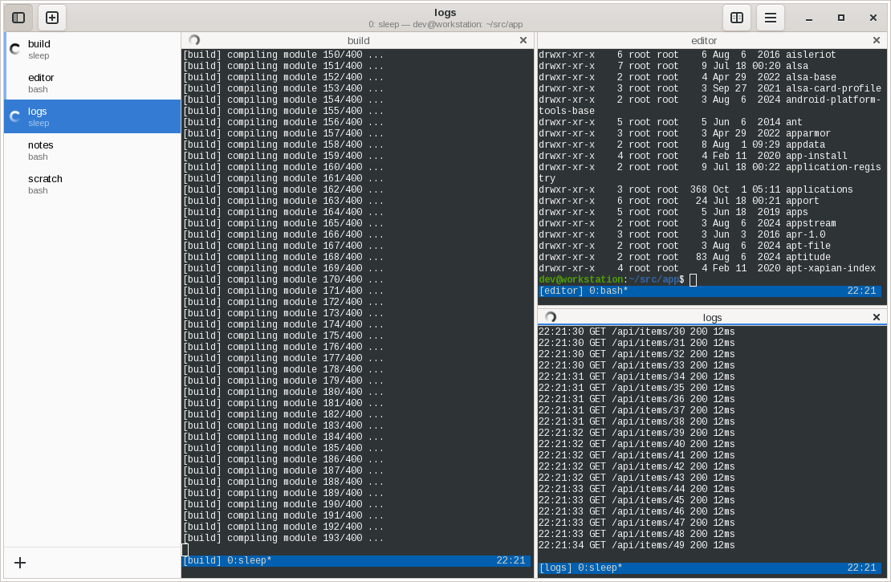

# tmux-tabbed-terminal



A terminal for people who live in tmux. It looks like GNOME Terminal, but instead of tabs
it lists the tmux sessions running for you in a sidebar. Click a session to switch to it,
or split the window to watch several sessions side by side.

* **Session list.** Every session on your tmux server, in tmux's order, with what its
  current window is running. Sessions made or killed outside the app show up within a
  second.
* **Other hosts.** "Add Host" under the list connects to another machine over ssh and
  lists its tmux sessions under its own heading, below this machine's ("local"). Remote
  sessions open in panes like local ones.
* **Saving scrollback.** Right-click a session, or a terminal, and choose Save Scrollback
  to save the whole tmux history of its current pane as text, under
  `~/.local/share/tmux-tabbed-terminal/scrollback/<host>/<session>/<date-time>.txt`, or
  Save Scrollback As… to choose where.
* **Pinned sessions.** Right-click a session and choose Pin to list it at the top, in a
  collapsible Pinned section, as well as in its usual place. Pins are kept by host and
  session name, so they survive tmux restarts. A pinned session that isn't running is
  greyed out, and clicking it starts it again under that name. The button on the Pinned
  heading hides the ones that aren't running.
* **Grouping and search.** Sessions are grouped by the program running in their current
  window, so all your `claude` sessions sit together (toggle it under the list). The
  search box at the top filters by session name, program or window name.
* **Activity.** A session producing output shows a gently pulsing dot in the list and in
  its pane header. A session that produced output while it wasn't on screen is shown in bold
  with a dot until you look at it. Activity comes from tmux's own `window_activity`
  time, so it works for sessions that aren't displayed.
* **Splits.** Split a pane right or down, then pick a session for the new pane from
  the list. Or drag a session from the list onto a pane, as in VS Code: drop it near an
  edge to split that side, or in the middle to show it in that pane. Drag it out of the
  window to open it in a window of its own, with the session list hidden (on X11; Wayland
  doesn't tell applications where the pointer is outside their windows). Splits nest, and
  their dividers can be dragged.
* **Scrolling.** The mouse wheel scrolls tmux's history, speeding up the faster the wheel
  spins. A scrollbar beside each terminal shows where you are in tmux's history (not
  the terminal's, which tmux redraws in place) and scrolls it when dragged. Both work
  whether or not tmux's `mouse` option is on. Programs that use the mouse
  or the full screen, such as vim, less and htop, get the wheel as usual.
* **GNOME look.** Font and colors come from GNOME Terminal's default profile if it's
  installed, otherwise from the desktop monospace font and the GTK theme. Preferences
  (Ctrl+comma) picks another GNOME Terminal profile, the GTK theme, one of GNOME
  Terminal's built-in schemes or custom colors, and the font. The profile in use is
  followed live as it's edited in GNOME Terminal, and the session list's colors are
  derived from the terminal's.

Each pane runs an ordinary `tmux attach-session` client in a VTE terminal, so your tmux
configuration, key bindings and status line all work as usual. Switching a pane to another
session uses `tmux switch-client`, which is instant. Closing a pane or window detaches; it
never kills a session.

## Install

Packages are built for Ubuntu 24.04 and 26.04 and for RHEL 8 and 10 (and rebuilds such as
Rocky Linux and AlmaLinux), for amd64 and arm64. They're signed with the key
`4EE9 6BF5 C3BE 937F DD2D  0109 47CC C9AA 4B3F D5DE`. Each
[GitHub release](https://github.com/wrouesnel/tmux-tabbed-terminal/releases) also has them
attached.

### Ubuntu 26.04 (PPA)

```sh
sudo add-apt-repository ppa:w-rouesnel/tmux-tabbed-terminal
sudo apt install tmux-tabbed-terminal
```

### Ubuntu 24.04

An APT repository on GitHub Pages:

```sh
sudo install -d -m 0755 /etc/apt/keyrings
sudo curl -fsSLo /etc/apt/keyrings/tmux-tabbed-terminal.gpg \
    https://blog.wrouesnel.com/tmux-tabbed-terminal/key.gpg
sudo tee /etc/apt/sources.list.d/tmux-tabbed-terminal.sources <<EOF
Types: deb
URIs: https://blog.wrouesnel.com/tmux-tabbed-terminal
Suites: noble
Components: main
Signed-By: /etc/apt/keyrings/tmux-tabbed-terminal.gpg
EOF
sudo apt update
sudo apt install tmux-tabbed-terminal
```

### RHEL 8 and 10

A dnf repository on GitHub Pages. Use `el8` or `el10` to match the release:

```sh
sudo curl -fsSLo /etc/yum.repos.d/tmux-tabbed-terminal.repo \
    https://blog.wrouesnel.com/tmux-tabbed-terminal/rpm/tmux-tabbed-terminal-el10.repo
sudo dnf install tmux-tabbed-terminal
```

dnf asks to import the signing key the first time. RHEL 8's tmux is 2.7, which works.
RHEL 10's tmux is a pre-release snapshot (it reports `next-3.4`) whose `capture-pane`
corrupts its memory and kills the server, so Save Scrollback refuses to run against it
rather than end every session; everything else works.

## Usage

Start it from the desktop menu ("Tmux Tabbed Terminal") or run `tmux-tabbed-terminal`.
Running it again opens another window in the same instance. `--separate` starts an
independent instance instead.

In the session list, click a session to show it in the focused pane, or drag it onto a
pane. Middle-click or
Ctrl+click opens it in a new pane to the right. Right-click gives Open in Split Right,
Open in Split Down, Rename and Kill. In a terminal, right-click (Shift+right-click if the
program is using the mouse) gives copy, paste and split.

| Shortcut | Action |
|---|---|
| Ctrl+Shift+T | New session in the focused pane |
| Ctrl+Page Down / Ctrl+Page Up | Next / previous session in the focused pane |
| Alt+1 … Alt+9 | Show the session at that position |
| Ctrl+Shift+E | Split right |
| Ctrl+Shift+O | Split down |
| Ctrl+Tab / Ctrl+Shift+Tab | Focus the next / previous pane |
| Ctrl+Shift+W | Close pane (the session keeps running) |
| Ctrl+Shift+R | Rename the focused pane's session |
| Ctrl+Shift+C / Ctrl+Shift+V | Copy / paste |
| Ctrl+plus / Ctrl+minus / Ctrl+0 | Zoom in / out / reset |
| Ctrl+Shift+S | Show or hide the session list |
| Ctrl+Shift+F | Search sessions (Enter opens the first match, Escape returns to the terminal) |
| Ctrl+Shift+N | New window |
| Ctrl+comma | Preferences |
| Ctrl+Shift+Q | Close window |
| F11 | Full screen |

If a pane's client detaches (`prefix d`), the pane offers to reattach. If its session
ends, the pane closes, or, if it's the only pane, moves on to the most recently active
session.

## Configuration

Choices made in the UI, such as which side the session list is on, whether it's grouped,
pinned sessions and Preferences, are remembered in `~/.local/state/tmux-tabbed-terminal/state.yml`.

Configuration is optional. The application reads
`~/.config/tmux-tabbed-terminal/config.yml` if it exists, or the file given with
`--config-file`. [`packaging/config.example.yml`](packaging/config.example.yml) lists every
setting with its default, and `tmux-tabbed-terminal config` prints the configuration in
effect. The commonly changed settings are:

```yaml
tmux:
  socket-name: work        # use a tmux server other than the default, as with tmux -L
appearance:
  font: "Monospace 12"
  palette: [tango]         # or a list of 16 colors
activity:
  timeout: 2s              # how long a session shows as busy after output stops
```

## Remote hosts

"Add Host" takes an ssh destination: `user@host`, or an alias from `~/.ssh/config`, which
is the place for ports, jump hosts and keys. The dialog lists the concrete hosts of
`~/.ssh/config` and the files it includes (wildcard patterns are left out); typing
filters the list, a click fills in the host and a double click adds it. The host needs tmux installed, and key or
agent authentication: the session list is polled in the background with ssh's
`BatchMode`, so it can't prompt for a password. If ssh has never seen the host's key,
connect to it once by hand to accept it.

All commands to a host share one ssh master connection (`ControlMaster`), started on first
use and kept for 10 minutes after the last. Its socket is under
`$XDG_RUNTIME_DIR/tmux-tabbed-terminal/`. Hosts added in the UI are saved to
`~/.config/tmux-tabbed-terminal/hosts.yml`, and the configuration file's `hosts:` key can
list more:

```yaml
hosts:
  - destination: buildbox
  - destination: admin@db.example.com
    ssh-options: ["-p", "2222"]
    socket-name: work      # a tmux server other than the default, as with tmux -L
```

Add Host's Origin picks where the host is reached from: this computer, or any listed host,
typed or picked from the dropdown. A host reached through an origin runs its ssh *on the
origin*, with the origin's `~/.ssh/config` and keys, and the dialog lists that host's
configured hosts. Hosts can be chained to any depth (`db via bastion via vpn-gw`); each
hop keeps its own ssh master connection on the host it runs from (in `~/.ssh/ttt-*`
there). If the origin has no key of its own for the host, tick "Forward my ssh agent
through the origin"; it's off by default because anyone with root on the origin can use
a forwarded agent. Removing a host also removes the hosts reached through it, after
listing them. A tunneled host in the configuration file names its origin with `via:`:

```yaml
hosts:
  - destination: bastion
  - destination: db        # an alias in bastion's ~/.ssh/config
    via: bastion
    forward-agent: true
```

With more than one host, New Session asks which host to start it on. The "+" beside a
host starts one there directly, and its ⋯ menu also removes the host. Removing a host leaves
panes already attached to its sessions running.

## Building

Building needs Go 1.26 or newer, the GTK3 and VTE development headers, and tmux for the
tests. On Ubuntu:

```sh
sudo apt install libgtk-3-dev libvte-2.91-dev tmux xvfb
go run mage.go binary
./tmux-tabbed-terminal
```

| Target | Result |
|---|---|
| `go run mage.go binary` | Builds into `bin/` and symlinks the binary into the repository root. |
| `go run mage.go test` | Runs the tests. The GUI test runs under `xvfb-run` and is skipped without it. |
| `go run mage.go lint` / `style` | golangci-lint and formatting checks, as CI runs them. |
| `go run mage.go rpm linux-amd64` | Builds `release/tmux-tabbed-terminal-<version>-1.<dist>.x86_64.rpm` on the RHEL release it's for, with `gtk3-devel`, `vte291-devel` and `rpm-build` installed. |
| `go run mage.go debSource resolute` | Builds a source package for an Ubuntu suite, with the Go modules vendored, in `release/ppa/`; `DEB_SIGNING_KEY` signs it. |
| `go run mage.go deb linux-amd64` | Builds `release/tmux-tabbed-terminal_<version>_amd64.deb`. Dependencies come from `dpkg-shlibdeps`, so build on the release you're packaging for. |
| `go run mage.go aptRepo` | Builds an APT repository in `.apt-repo/` from the `.deb` files in `release/` and `$APT_POOL_DIR`, signed with the gpg key whose fingerprint is `$APT_SIGNING_KEY` (and passphrase `$APT_SIGNING_PASSPHRASE`, if it has one). |
| `go run mage.go rpmRepo` | Adds dnf repositories for each RHEL release and architecture, and their `.repo` files, to `.apt-repo/rpm` from the `.rpm` files in `release/` and `$RPM_POOL_DIR`, signed with `$RPM_SIGNING_KEY`. Run it after `aptRepo`, which starts the site afresh. |

The application uses cgo to link GTK3 and VTE, so each architecture is built on a machine
of that architecture. Cross-compiling needs `CC` and `PKG_CONFIG_LIBDIR` set for the target.

## Releases and package repositories

Pushing a `v*` tag runs `.github/workflows/release.yml`. It does the following:

1. Runs the integration checks.
2. Builds the archive and Ubuntu 24.04 `.deb` for amd64 on `ubuntu-24.04` and arm64 on
   `ubuntu-24.04-arm`.
3. Builds the RHEL 8 and 10 RPMs in Rocky Linux 8 and AlmaLinux 10 containers, on both
   architectures, with `go run mage.go rpm`. Older GTK libraries, as on RHEL 8, are
   detected with `pkg-config` and selected in gotk3 with build tags.
4. Attaches them all to a GitHub release.
5. Builds a signed source package for Ubuntu 26.04 with `go run mage.go debSource
   resolute`, Go modules vendored in, and uploads it to the PPA, where Launchpad builds
   it. Launchpad builds offline with Ubuntu's Go, which is why `go.mod` targets Go 1.26.0;
   CI checks the package builds that way.
6. Rebuilds the APT and dnf repositories from the packages of every release, signs them,
   and deploys them to GitHub Pages. Pages holds no state of its own.

The repositories can be rebuilt without a release by running the workflow manually.

One-time setup:

* Under Settings → Pages, set the source to **GitHub Actions**.
* Create the package signing key in your personal keyring (`~/.gnupg`), with its
  passphrase kept in the login keyring:

  ```sh
  secret-tool store --label "tmux-tabbed-terminal package signing key passphrase" \
      gpg-passphrase tmux-tabbed-terminal-packages
  secret-tool lookup gpg-passphrase tmux-tabbed-terminal-packages |
      gpg --batch --pinentry-mode loopback --passphrase-fd 0 \
          --quick-gen-key "tmux-tabbed-terminal packages <wrouesnel@wrouesnel.com>" rsa4096 sign 5y
  FPR=$(gpg --with-colons --list-keys "tmux-tabbed-terminal packages" | awk -F: '/^fpr/ { print $10; exit }')
  ```

  Your keyring holds the key from then on; scripts and configuration refer to it by
  fingerprint. It's RSA, as RHEL 8's rpm can't check EdDSA signatures. Users trust its
  public part through the repositories' `key.gpg` and `key.asc`, so replacing it breaks
  their `apt update` and `dnf`.
* Give the release workflow the key. This is the one step where the private key leaves
  your keyring, so it's one you run deliberately: the workflow signs each release's
  repository metadata on GitHub's runners, which can't reach your keyring. GitHub keeps
  secrets encrypted and only hands them to workflow runs of this repository.

  ```sh
  gpg --armor --export-secret-keys "$FPR" | gh secret set PACKAGE_SIGNING_KEY
  secret-tool lookup gpg-passphrase tmux-tabbed-terminal-packages |
      gh secret set PACKAGE_SIGNING_KEY_PASSPHRASE
  gh variable set PACKAGE_SIGNING_KEY_FINGERPRINT --body "$FPR"
  ```
* For the PPA, on Launchpad: create the PPA `tmux-tabbed-terminal`
  (https://launchpad.net/~w-rouesnel/+activate-ppa), and register the signing key with the
  account (https://launchpad.net/~w-rouesnel/+editpgpkeys) after publishing its public
  part, which Launchpad fetches from the Ubuntu keyserver:

  ```sh
  gpg --keyserver keyserver.ubuntu.com --send-keys "$FPR"
  ```

  Launchpad emails a message encrypted to the key; decrypting it confirms it. The
  workflow uploads to `ppa:w-rouesnel/tmux-tabbed-terminal`, or to the PPA named by the
  `PPA` repository variable.

## License

MIT: see [LICENSE](LICENSE). The binary links
[github.com/yuseferi/zax](https://github.com/yuseferi/zax), which is GPL-3.0, through
`go.logutil`, so binary packages are distributed under the GPL-3.0 as well.

## Implementation

| Path | Purpose |
|---|---|
| `cmd/tmux-tabbed-terminal` | `main`. It only calls the entrypoint. |
| `pkg/entrypoints/tmux_tabbed_terminal` | Command line, logging, configuration loading, and the `run` and `config` commands. |
| `pkg/ui` | The GTK3 interface: application, windows, sidebar, pane split tree, terminal panes, appearance and menus. |
| `pkg/vte` | cgo bindings for the parts of VTE the UI uses. |
| `pkg/tmux` | Runs tmux commands, locally or over ssh, and parses their format output into snapshots of sessions, windows and clients. |
| `pkg/gtkx` | cgo bindings for the few GTK functions gotk3 lacks (drag and drop). |
| `pkg/sshconfig` | Lists the concrete hosts of an OpenSSH client configuration, following `Include`. |
| `pkg/sessionlist` | Groups sessions by application, orders and filters the session list. |
| `pkg/activity` | Decides which sessions are busy or have unseen output, from successive snapshots. |
| `pkg/theme` | Color parsing and GNOME Terminal's built-in palettes. |
| `packaging/` | Desktop entry, icon, AppStream metadata and example configuration for the package. |
| `magefile.go`, `magefile_deb.go` | The build system, plus the Debian package and APT repository targets. |

Each host has a background goroutine which polls its tmux server once per `poll-interval` with one command that lists
sessions, windows and clients. It polls sooner when a visible terminal shows output. Each
snapshot is handed to the GTK main loop, which updates the session list, the activity
indicators, and which session each pane shows (a client can change session inside tmux,
for example with `prefix s`).

Each pane's tmux client runs on a pty created by VTE but started with Go's `os/exec`, so
Go owns the process and knows its tty. `switch-client -c <tty>` then moves that client to
another session.
